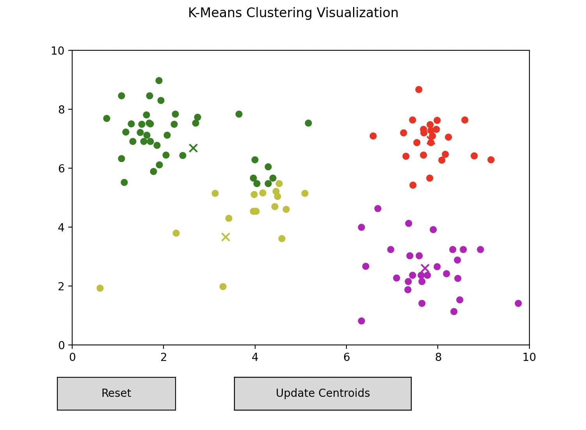

### K-Means Clustering Visualization

An interactive visualization of the k-means algorithm for identifying clusters in data. 
K-Means Clustering is an unsupervised learning technique used to classify data samples
based on feature similarity to other data.

This visualization is created using matplotlib in Python. Users can add data points,
add initial centroid positions, and watch the assignments of points to clusters change
with each iteration of the algorithm.

